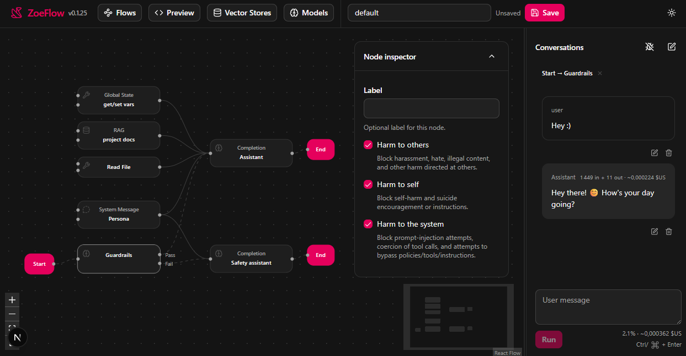

# ZoeFlow

ZoeFlow is a visual node-based editor for building AI workflows and conversation chains. Create complex interaction flows by connecting nodes in an intuitive graph interface.

Terminology is defined in `documentation/terminology.md`.
Node authoring notes live in `documentation/node-authoring.md`.

## What is ZoeFlow?

ZoeFlow provides a visual programming environment where you design a **flow** by connecting **nodes** in a **graph**. Each node represents an operation or decision point, allowing you to build conversational systems, data transformations, and conditional routing.

## Features

- **Visual Graph Editor**: Drag-and-drop interface for building flows
- **LLM Integration**: Connect to various AI models through OpenRouter
- **Streaming Responses**: Real-time streaming of LLM responses with progressive markdown rendering
- **Conditional Logic**: Use If/Else and Switch nodes to create branching flows
- **Data Transformation**: Transform and manipulate data between nodes
- **Message Management**: Add system/user messages that feed into completions
- **Tool Calling**: Support for function calling and tool usage in AI completions
- **Vector Store**: Server-side storage for embeddings with semantic search capabilities
- **RAG (Retrieval-Augmented Generation)**: Retrieve relevant context from vector stores to enhance AI responses
- **Document Vector Store Management**: User-facing UI for managing multiple vector stores, uploading markdown documents, and monitoring automated document processing (chunking, embedding, indexing)
- **AI-Assisted Document Processing**: Automatic markdown-aware chunking and embedding with heading-based sectioning
- **READ Tool**: LLM-accessible tool for reading full documents or specific sections after RAG retrieval
- **Interactive Chat**: Test and interact with your flows through a built-in chat interface

## Node Categories

Nodes are grouped into categories in the "Add node" palette:

- **Boundaries**: Start, End
- **Control**: If/Else, Switch
- **Constant**: Message
- **Function**: Redact, Transform
- **Tools**: RAG, CoinFlip, DiceRoll, ReadDocument
- **Agent**: Completion, Guardrails

Terminology is defined in `documentation/terminology.md`.

## Document Vector Store Management

ZoeFlow opens a dialog from the Graph editor toolbar for managing document-based vector stores:

- **Multiple Stores**: Create and manage multiple vector stores with unique IDs
- **Document Upload**: Upload markdown files (.md) to be processed and indexed
- **Automated Processing**: Documents are automatically chunked (with markdown-aware sectioning), embedded, and indexed in the background
- **Processing Status**: Monitor document processing status (pending, processing, completed, error)
- **Enhanced RAG**: RAG nodes can now retrieve context from document chunks with metadata (doc_id, source_uri, version, heading_path)
- **READ Tool**: LLMs can use a READ tool to access full documents or specific sections after initial RAG retrieval

Open this dialog through the Vector Stores button in the Graph toolbar whenever you need to manage your stores.

The document processing pipeline follows the specification in `documentation/MarkdownRagWorkflowSpec.md`, integrating with ZoeFlow's existing vector store infrastructure.

## Node UI strings

- **Title**: The node name shown on the node.
- **Label**: Optional user-defined label (empty by default) shown under the title (some nodes may hide it on the canvas).
- **Description**: Palette-only help text (not shown on the node).

## Technologies Used

- **Next.js** - React framework for the web application
- **@xyflow/react** (formerly React Flow) - Visual graph editor and node-based interface
- **Radix UI** - Accessible UI component primitives
- **Nanostores** - Lightweight client side state management
- **Tailwind CSS** - Utility-first CSS framework
- **Lucide React** - Icon library
- **SimpleBar** - Custom scrollbar component

## Development scripts

- `npm run dev` - Start the dev server
- `npm run format` - Format the codebase with Prettier
- `npm run format:check` - Check formatting without writing changes
- `npm run lint` - Run ESLint
- `npm run lint:fix` - Fix lint issues where possible
- `npm run typecheck` - Run TypeScript typechecking
